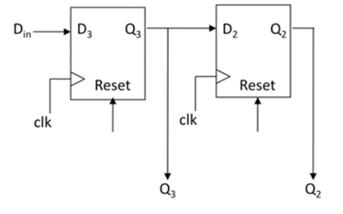
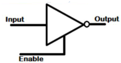
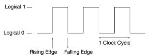
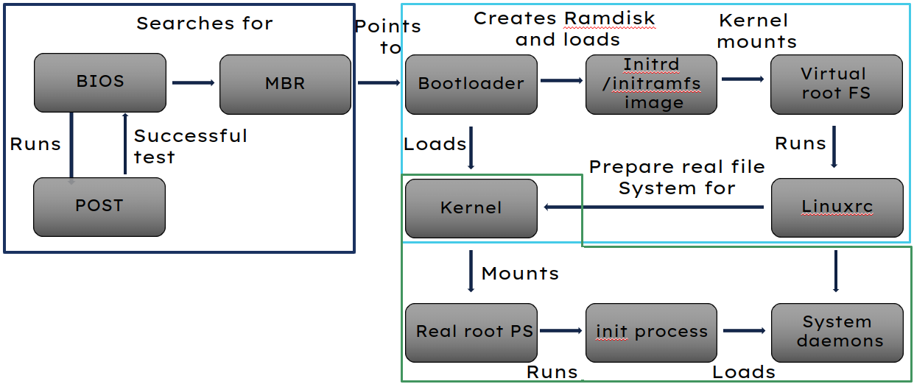

# Revision

Content

- [Revision](#revision)
  - [Computer Architecture](#computer-architecture)
  - [OS](#os)
  - [Shell](#shell)

## Computer Architecture

1. Draw a 2-bit register, how would you/ can you make it 4 or 8 bit?

    <details>
    <summary>Answer</summary>

    

    You can by repeating the pattern.

    </details>

2. Write the truth table and symbol diagram of tri-state logic. When do we use tri-state logic in digital logic circuits? 

<details>
<summary>Answer</summary>

<div>

|Input|Enable|Output|
|---|---|---|
|0|0||
|0|1|0|
|1|0||
|1|1|1|

</div>

<div align=center>



</div>

</details>

3. A clock cycle has many features, can you identify the triggers, which one is best for synchronisation?

    <details>
    <summary>Answer</summary>

    <div align=center>

    

    </div>

    - 1 triggered when the clock cycle becomes 1 

    - 0 triggered when the clock cycle becomes 0
  
    - Positve edge is triggered when the clock cycle changes 0 to 1 

    - Negative edge is triggered when the clock cycle changes 1 to 0 

    - Rising Edge or falling edge triggers are better in synchronization with the digital circuits as they provide enough time to switch on/off the logic circuit. 

    </details>

4. In the context of computer architecture, what is a bus? How many types can you name and define?

    <details>
    <summary>Abswer</summary>

    - A bus is a collection of conductive wires that connect a number of logical elements together, to allow values to be moved from one element to another in the processor. Three main buses are data bus, address bus, and the control bus. 

    - Features:-  

      - All control wires of control bus originate from Control Unit of the processor. 

      - They represented in logic circuit diagram with dark lines and each line of control bus is uni-directional. 

      - Data bus is bi-directional and control bus is uni-directional 

    </details>

5. Compare and contrast RISC(RISC (Reduced Instruction Set Computing) and CISC (Complex Instruction Set Computing)

<details>
<summary>Answer</summary>

| Feature                       | CISC                                     | RISC                                     |
|-------------------------------|------------------------------------------|------------------------------------------|
| Instruction Set Complexity   | High: Features a large and complex instruction set with instructions capable of performing multiple operations. | Low: Emphasizes simplicity with a smaller, more streamlined instruction set where each instruction performs a single operation. |
| Instruction Execution         | Variable: Instructions may require multiple clock cycles to execute due to their complexity. | Uniform: Most instructions execute in a single clock cycle, leading to more predictable performance. |
| Microcode Usage              | Common: Utilizes microcode to decode and execute complex instructions. | Minimal: Relies on hardware implementation for instruction execution, reducing the need for microcode. |
| Hardware vs. Software Control | More reliance on software control for instruction execution, including microcode routines. | More emphasis on hardware control, with instructions executed directly by the hardware. |
| Register Usage                | Moderate: Typically includes a moderate number of general-purpose and special-purpose registers. | High: Features a larger number of general-purpose registers to optimize performance and reduce memory access. |


</details>

6. RISC computer architecture was developed to address the limitations of CISC computer architecture. What are the main RISC architecture improvements? 

    <details>
    <summary></summary>
    1. **Simplicity and Efficiency**: RISC architectures prioritize simplicity and efficiency by employing a smaller and more streamlined instruction set. This simplicity allows for faster instruction decoding and execution.

    2. **Uniform Instruction Format**: RISC architectures typically have a uniform instruction format, where each instruction is of fixed length and performs a single operation. This uniformity simplifies instruction decoding and pipelining.

    3. **Increased Register Usage**: RISC architectures often feature a larger number of general-purpose registers compared to CISC architectures. More registers allow for more operations to be performed directly on data in registers, reducing the need for memory accesses.

    4. **Load/Store Architecture**: RISC architectures commonly use a load/store architecture, where memory access is restricted to specific load and store instructions. This approach simplifies instruction decoding and improves performance by reducing memory traffic.

    5. **Optimized Pipelining**: RISC architectures are designed to facilitate efficient pipelining of instructions. With simpler instructions and a regular 5. instruction format, RISC processors can achieve higher throughput and better performance through pipelining.

    6. **Faster Clock Speeds**: The simplicity of RISC instruction sets and architectures allows for higher clock speeds compared to CISC architectures. This enables RISC processors to achieve better performance in terms of instructions per cycle.

    7. **Reduced Hardware Complexity**: RISC architectures often have reduced hardware complexity compared to CISC architectures, resulting in smaller and more cost-effective processor designs.
    
    - In summary: 

      - More general purpose register, typical 32 

      - A limited, uniform, and faster instruction set 

      - Very limited addressing modes 

      - Hardware compiler support 

      - Hardwired control unit 

    </details>

7. Hybrid computer architectures have taken over the computer system consumer market. What is a Modern hybrid architecture?

    <details>
    <summary>Answer</summary>
    
    Modern processors are a hybrid of both RISC and CISC architectures, using the best of each architecture where it is most appropriate. For example Intel Pentium Pro processor families roots are with CISC but it uses both CISC and RISC features. Intel X86 origin is RISC architecture but they also use same hybrid architecture approach and remain backwardly compatible to run millions of old programmes of this processor family  

    </details>

8. Computer systems are improving continuously. Describe Advanced architecture features.

    <details>
    <summary></summary>

    There is continuous development in advanced processors to run programs as fast as possible, as cheap as possible. All von Neumann processors used in mobile phone, microwave, TV, desktop. Our aim is to design high speed and low cost processors. Following are the few advanced features that can run programs more efficiently: 

    - Increasing Clock Speed 

    - Adding Specialised Instructions 

    - Moving Memory into Processor 

    - Running More Instructions Per Clock Cycle 

    - Adding More Processors 
    

    </details>

9. Superscalar multiprocessor computers use several modern techniques to improve the performance of computer systems. Explain how pipelining in superscalar multiprocessor computer architecture works. 

    <details>
    <summary></summary>

    Pipelining in advanced superscalar architecture involves dividing up the functional aspects of the processor into distinct stages, where each stage is designed to perform its function in one clock cycle and pass data on to the next stage. This architecture has duplicate components within it. Duplicating the pipelines such that a processor has two or more pipelines the processor can achieve greater throughput of instructions. 

    </details>

---------------------------

## OS

10. Explain the boot process, and draw an overview of the process.

    <details>
    <summary>Answer</summary>

    - **BIOS Stage**:
      -  When the machine is powered on BIOS is the first one to be called to verify if the hardware is present in the machine and if it is functioning.​
      -  After a successful test, BIOS checks the MBR (Master Boot Record) in the hard disk to check if it refers to the location of the boot loader.​

    - **Bootloader Stage**
      - The boot loader will present the user with a list of menu entries, each of which corresponds to different operating system​
      - The boot loader will then start to boot the operating system
      - Which is loaded into the **initrd** or **initrfs**
      -  A virtual instance of the root file system is mounted
      - all hardware, drivers and mass storage are probed for the kernel

    - **Kernel Stage**
      - In the kernel stage of the Linux boot sequence, the Linux kernel based on the result of **linuxrc** can then mount the real root file system​
      - The real root file system in Linux is referenced as "/" and it is where all other sub-directories and files visible when Linux is running exist​
      - init process dis spawned and all daemons.

    

    </details>

11.  What are the components of a Linux operating system?
        <details>
        <summary>Answer</summary>

       - Kernel

       - System Library

       - System Utility

       - User Application

       - Hardware Platform

        </details>


12. List the different types of operating systems. 


    <details>
    <summary>Answer</summary>
    
    - Batch operating system.
    - Embedded operating system.
    - Distributed operating system.
    - Multi-processing/tasking operating system.
    - Network operating system.
    - Real-time operating system.
    - Time-sharing operating system.

    </details>

13. What is the difference between hard and soft *real-time* systems?

    <details>
    <summary>Answer</summary>
    
    - A **Soft RTOS** is a system in which the deadline for certain tasks can be delayed to some extent. For example, if the task deadline is 1:20:30PM, then the task can on occasion completed at let us say 1:20:35PM. However, it can not delay for too long say 1:30PM.​

    - A **Hard RTOS** is a system that meets the deadline for every process at all times. For example, if the task deadline is 1:20:30PM, then the task has to be completed before 1:20:30PM every time.​

    </details>
14. Explain the following:
    
    - Login Manager

        <details>
        <summary>Answer</summary>
        
        - Manage user authentication at login.
        - Present login screen for entering credentials.

        </details>

    - Display Manager

        <details>
        <summary>Answer</summary>
        
        - Control the display server connection.
        - Facilitate user sessions.

        </details>

    - Desktop Manager

        <details>
        <summary>Answer</summary>
        
        - Integrated suite of applications and tool**Regular Expressions**.
        - Provides a cohesive user interface.

        </details>

    - Windows Manager

        <details>
        <summary>Answer</summary>

        - Control the placement and appearance of windows.
        - Handle window decorations, title bars, and borders.
        
        </details>

-----------------------

## Shell

15. Explain the following output, breaking down each part into its sub-components.

    ```sh
    .rwxrw--wx Linux users
    ```

    <details>
    <summary>Answer</summary>

    - `.` means a file in situ of its directory
    - `rwx` are the permissions for that file, `r` = read, `w` = write, `x` = execute
    - the `-` means that permission is revoked
    - the permissions format is user, group, and rest of the word
      - user has read, write, and execute
      - group has read and write
      - rest of the world has write and execute

    </details>

16. What is the difference between `.`, `d` and `l` when referring to file permissions 
    <summary>Answer</summary>

    - `.` means a file in-situ of its directory
    - `d` means a directory
    - `l` means a link to another place.

    </details>
    
    <details>
    <summary>Answer</summary>

    - `1000` is passed to the `sleep` command which tells the current shell input/ouput to wait 1000 seconds. 
    - the `&` puts the process in the background so the user can continue using the CLI if needed.
    - any process put in the background using `&` will return the process ID for the user to take reference of.

    </details>

17. Explain how the following two lines when the script is invoked from the CLI: 

    - shebang one
        ```sh
        #! /usr/bin/env cat
        ```
    - shebang two
        ```sh
        #! /usr/bin/env bash
        ```
    - `TestScript.sh`
        ```sh
        # Put the shebang here...

        cat /etc/os-release | grep -m 1 "NAME=" | awk -f '=' '{print$2}' 
        ```

    <details>
    <summary>Answer</summary>

    - `/usr/bin/env cat` tells the interpreter to find the env path for `cat` and reinvokes `TestScript.sh`
      - `#! /usr/bin/env cat TestScript.sh`
      - which in turn concatenates `TestScript.sh` to standard out. 
 
    - `/usr/bin/env bash` tells the interpreter to find the env path for `bash` and reinvokes `TestScript.sh`
      - `#! /usr/bin/env bash TestScript.sh`
      - which in turn runs the commands inside `TestScript.sh` to standard out. 
      - The command outputs the  name of the OS by con`cat`enating the file `/etc/os-release` 
      - standard out is piped to `grep` which finds the first instance of any pattern matching "`NAME=`". 
      - This is passed to `awk` which separates the `NAME=....` by the `=` as a delimiter. 
      - `awk` then prints the second field to standard out. Which in this case would be the OS's name.  
    </details>

18. What does `>` and `>>` mean? Illustrate with the following example:

    ```sh
    $ ls -l ~/currentuser/ > file
    $ ls -l ~/currentuser/ >> file
    ```


    <details>
    <summary>Answer</summary>
    
    - `>` redirects standard out to write to a file and overwrites any content therein. 
    - `>>` redirects standard out to append to the end of the file, this will not overwrite.
    -  The first time the file's content contains the list of the `currentuser` directory
    -  The second time the file is appended and now contains a list of the directory contents twice
    </details>

21. What is the POSIX and provide some features.

    <details>
    <summary>Answer</summary>

    - POSIX (Portable Operating System Interface) is a set of standard operating system interfaces based on the Unix operating system
    - **Aliases**, creating a single command word for complex commands
    - **C API**, programs are portable to other operating systems at the source code level
    - **File Formats**, for formatting strings that we use in files, standard output, standard error, and standard input.
    - Setting **Environment Variables**, like `PATH` or `HOME`
    - Creation and standardisation of **Regular Expressions** for pattern matching.
    - standardised **utility names**, `name_of_utility [-a] [-b] [-c option_argument] <parameter name>`
    - **Directory Structure**, is Hierarchical where root, `/` is the parent

    </details>